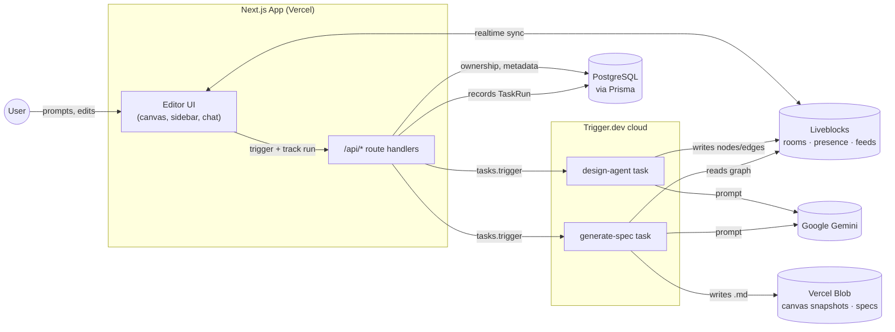

<div align="center">

# 👻 Ghost AI

**A real-time collaborative system design workspace.**
Describe a system in plain English — Ghost AI maps it onto a shared canvas, your team refines it together, and it writes the spec for you.

[](https://nextjs.org)
[](https://www.typescriptlang.org)
[](https://www.prisma.io)
[](https://liveblocks.io)
[](https://trigger.dev)
[](https://clerk.com)

</div>

---

## What it does

Ghost AI turns a plain-English description of a system into a live, editable architecture diagram — and then into a shareable spec.

1. **Sign in** and create a project.
2. **Prompt the AI** ("Design an e-commerce backend") from the sidebar.
3. Watch nodes and edges land on a **shared canvas**, in real time, as a background agent generates them.
4. **Collaborate** — everyone in the project sees the same canvas, cursors, and presence.
5. Start from a **starter template** (monolith, microservices, event-driven, serverless, …) instead of a blank canvas, any time.
6. **Generate a spec** — the current graph is turned into a Markdown technical specification you can review and download.

## Tech stack

| Layer               | Technology                | Role                                                             |
| ------------------- | -------------------------- | ----------------------------------------------------------------- |
| **Framework**       | Next.js 16 (App Router)    | Full-stack app, server/client boundaries                        |
| **Language**        | TypeScript                 | End to end                                                       |
| **UI**              | Tailwind CSS + shadcn/ui   | Dark-only design system                                          |
| **Auth**            | Clerk                      | Sign-in, sessions, route protection                              |
| **Database**        | PostgreSQL + Prisma        | Projects, collaborators, specs, task runs                        |
| **Realtime canvas** | Liveblocks + React Flow    | Shared nodes/edges, live cursors, presence, chat feed             |
| **Background jobs** | Trigger.dev                | Durable AI design & spec generation, off the request path        |
| **AI**              | Google Gemini (`ai` SDK)   | Architecture generation and spec writing                         |
| **Artifact storage**| Vercel Blob                | Canvas snapshots and generated Markdown specs                    |
| **Hosting**         | Vercel                     | App deployment                                                   |

## Architecture



Two things worth knowing before you touch this:

- **Request handlers never do AI work.** `POST /api/ai/design` and `POST /api/ai/spec` only validate, authorize, and enqueue a Trigger.dev task — the actual generation happens in `trigger/`, off the request path.
- **Trigger.dev tasks deploy separately from the app.** They run on Trigger.dev's own infrastructure, not inside the Vercel build, and they keep their own copy of environment variables. Pushing to `main` deploys the app; it does **not** deploy task changes — see [Deploying](#deploying) below.

## Getting started

### Prerequisites

- Node.js 20+
- A [PostgreSQL](https://www.prisma.io/postgres) database
- Accounts (free tiers are fine) for [Clerk](https://clerk.com), [Liveblocks](https://liveblocks.io), [Trigger.dev](https://trigger.dev), [Vercel Blob](https://vercel.com/storage/blob), and [Google AI Studio](https://aistudio.google.com/apikey)

### Setup

```bash
git clone https://github.com/BiancaMassaroto/ghost-ai.git
cd ghost-ai
npm install
```

Create `.env.local` in the project root:

```bash
# Clerk
NEXT_PUBLIC_CLERK_PUBLISHABLE_KEY=
CLERK_SECRET_KEY=
NEXT_PUBLIC_CLERK_SIGN_IN_URL=/sign-in
NEXT_PUBLIC_CLERK_SIGN_UP_URL=/sign-up

# Database
DATABASE_URL=

# Liveblocks
LIVEBLOCKS_PUBLIC_KEY=
LIVEBLOCKS_SECRET_KEY=

# Vercel Blob
BLOB_READ_WRITE_TOKEN=

# Trigger.dev
TRIGGER_PROJECT_REF=
TRIGGER_SECRET_KEY=

# Google AI
GOOGLE_AI_API_KEY=
```

`npm install` runs `prisma generate` automatically (see `postinstall` in [package.json](package.json)) and pushes the client to the custom output path Prisma is configured for.

Run the app:

```bash
npm run dev
```

In a second terminal, run the Trigger.dev dev server so `design-agent`/`generate-spec` actually execute locally:

```bash
npx trigger.dev@latest dev
```

Open [http://localhost:3000](http://localhost:3000).

## Deploying

- **App** — push to `main`; Vercel builds and deploys automatically.
- **Background tasks** — deploy them to Trigger.dev explicitly, they're not part of the Vercel build:

  ```bash
  npx trigger.dev@latest deploy
  ```

  Trigger.dev's cloud project keeps its **own** environment variables, independent of Vercel's. If a task depends on a new/changed env var, sync it to Trigger.dev too (dashboard, or `env` under Project Settings) — not just to Vercel.

## Project structure

```
app/                  Routes, layouts, and API handlers (App Router)
  api/                Authenticated request handlers — validate, authorize, enqueue, persist
  editor/             The collaborative canvas workspace
components/           UI composition — canvas, sidebars, dialogs
trigger/              Durable background tasks (AI design + spec generation)
lib/                  Shared infrastructure — Prisma client, access control, Liveblocks helpers
prisma/               Database schema
context/              Living project docs — overview, architecture, UI system, standards
```

## Scripts

| Command         | Description                                  |
| --------------- | --------------------------------------------- |
| `npm run dev`   | Start the Next.js dev server (Turbopack)      |
| `npm run build` | Production build                              |
| `npm run start` | Start the production server                   |
| `npm run lint`  | Run ESLint                                    |

---

<div align="center">

Built with Next.js, Liveblocks, and a healthy amount of Gemini-generated boxes and arrows.

</div>
